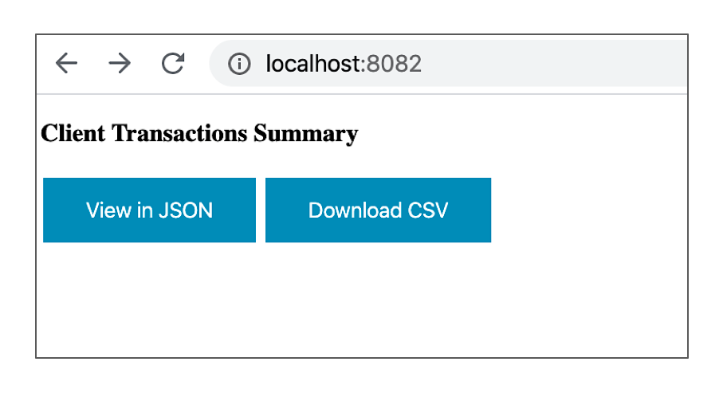

# Processor for Client Transactions


This processor consumes real-time client transactions from Kafka and exposes functionality for Transaction Details and Download Daily Summary Report.

transaction-producer has REST endpoints to refresh (http://localhost:8083/refresh) and publish (http://localhost:8083/publish) transactions onto KAFKA topic. For the purpose of this test, these are being invoked on Application Start-up.

transaction-consumer listens on the KAFKA topic, parses and stores the Transaction Objects in the Data Store. Two REST endpoints are exposed for viewing the Daily Summary Report in JSON (http://localhost:8082/report/json) and CSV (http://localhost:8082/report/downloadCsv) format.

Sample Output.csv has been included in the Project for reference

## Pre-Requisites

- install docker-compose [https://docs.docker.com/compose/install/](https://docs.docker.com/compose/install/)

## Starting the application

- Execute 'run.sh' from application-starter/bin
- This would run postgres and kafka using docker and starts up the Producer and Consumer Application
- Navigate to  http://localhost:8082 to view the home page for Daily Summary Report (JSON & CSV)
- Log file for the respective applications can be found in their respective logs/spring-boot-logger.log

## Troubleshooting

If there is a problem in running the docker services, try stopping the containers and/or removing the respective images
- ``` docker stop $(docker ps -a -q) ```
- ``` docker rm $(docker ps -a -q) ```

If one of the applications doesn't start, verify if any ports are in use and try killing the processes explicitly (Though, this has been handled in run.sh)
- ```kill $(lsof -t -i :8082)```
- ```kill $(lsof -t -i :8083)```
